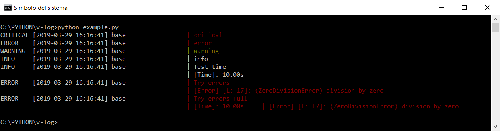

# Log
[](https://travis-ci.com/villoro/v-log)
[](https://codecov.io/gh/villoro/v-log)

Colored log that also stores a properly formated `csv`.

## Installation

You can install it with pip by running:

    pip install v-log

## Usage

It works very similar to the regular `logging` library:

```python
from v_log import VLogger
log = VLogger()

log.critical("critical")
log.error("error")
log.warning("warning")
log.info("info")
log.debug("debug")
```

It can also show execution times and errors:
```python
# Show time
log.info("Test time", time=10)

# Show error
try:
    1 / 0
except Exception as e:
    log.error("Try errors", error=e)
    log.error("Try errors %s", "full", time=10, error=e)
```

This will output the following:



## Customization

When creating the `VLogger` instance you can define:

| param             | description                                        | default      |
|-------------------|----------------------------------------------------|--------------|
| module_name       | name of the module                                 | "base"       |
| uri_log           | uri of the file where log will be stored           | "log.csv"    |
| file_log_level    | minimum level of log events in order to be writed  | logging.INFO |
| console_log_level | minimum level of log events in order to be printed | logging.INFO |
| csv_separator     | csv separator                                      | ";"          |
| base_path         | name of the root folder of the execution           | "src"        |

for example you could do:

```python
import logging
from v_log import VLogger
log = VLogger(__name__, uri_log="data/log.log", file_log_level=logging.WARNING)
```

## Authors
* [Arnau Villoro](https://villoro.com)

## License
The content of this repository is licensed under a [MIT](https://opensource.org/licenses/MIT).

## Nomenclature
Branches and commits use some prefixes to keep everything better organized.

### Branches
* **f/:** features
* **r/:** releases
* **h/:** hotfixs

### Commits
* **[NEW]** new features
* **[FIX]** fixes
* **[REF]** refactors
* **[PYL]** [pylint](https://www.pylint.org/) improvements
* **[TST]** tests
